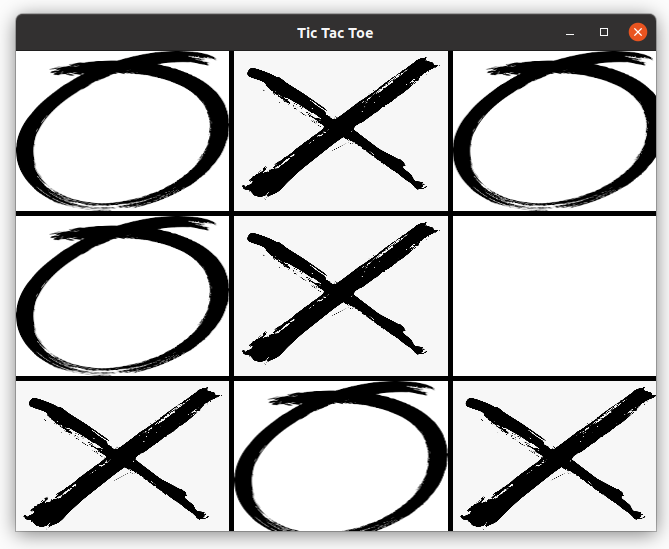

# tictactoe

[](https://github.com/guerinoni/tictactoe/actions/workflows/CI.yml)

Game of tic tac toe with a strong AI.

Suuport for Linux, macOS and Windows.



## Build

```bash
git clone git@github.com:guerinoni/tictactoe.git
cd tictactoe
mkdir build
cd build
cmake ..
cmake -build .

# if you want run tests
ctest
```

## Lint

Run clang-format
```
./scripts/clang-format.sh
```

Run clang-tidy (pass build-dir-path)
```
./scripts/clang-tidy.sh ../build-tictactoe-Desktop_Qt6-Debug/
```


## Contributing

1. Any kind of help is welcome (issue, comment, request, PR...).
2. Make sure to run `./scripts/clang-format.sh` before PR.
3. Enjoy.